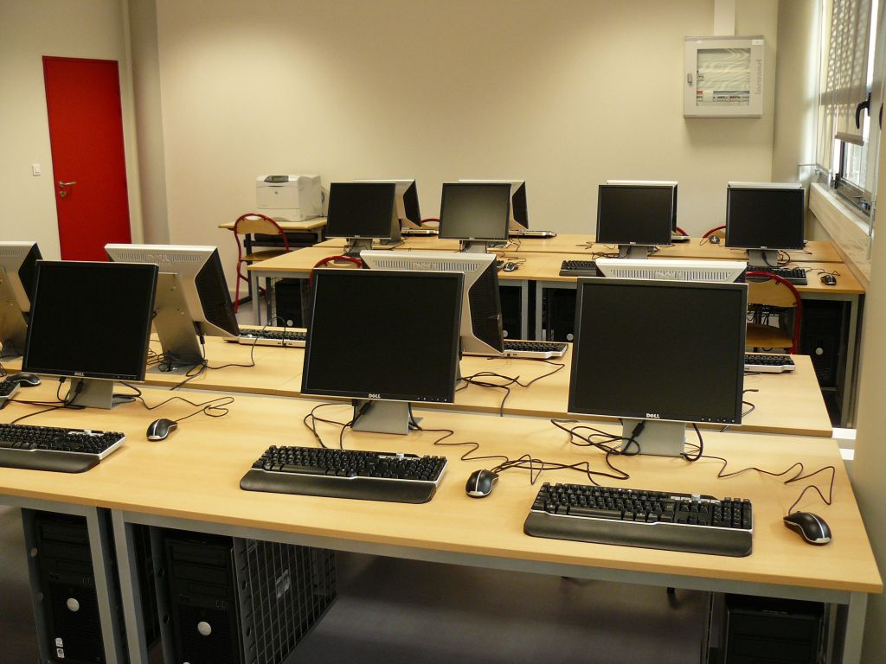

# C'est quoi l'informatique

## Définition

<!-- layout : Deux colonnes -->

<!-- zone : Colone1 -->

l'informatique est un science qui permet de réaliser des outils de traitement automatique 
de l'information. l'informatique est un science qui permet de réaliser des outils de traitement 
automatique de l'information.

1. Gestion
2. Application

<!-- zone : Colone2 -->

## Listes

les domaines d'application

1. Programmation
2. Bureautique

l'informatique est un science qui permet de réaliser des outils de traitement automatique 
de l'information. l'informatique est un science qui permet de réaliser des outils de traitement 
automatique de l'information.

